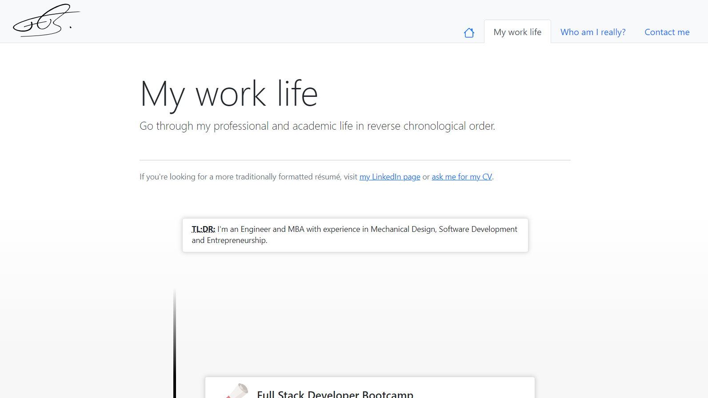
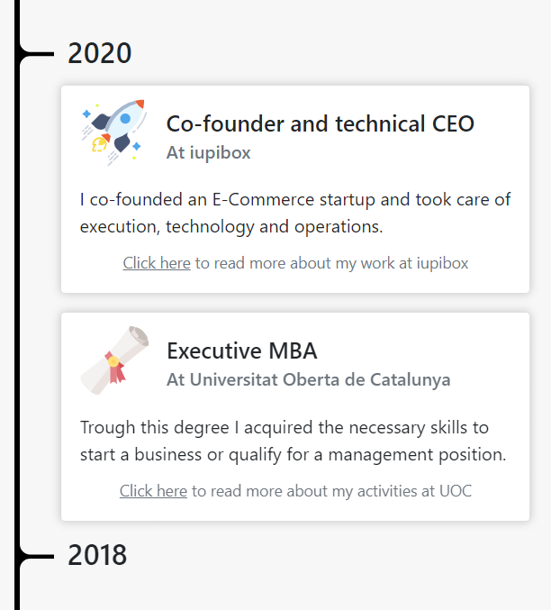

<h1 align="center">
   My website
</h1>

<h4 align="center">A personal website oriented to employers and business partners</h4>

 

  <a href="#about">About</a> •
  <a href="#usage">Usage</a> •
  <a href="#dependencies">Dependencies</a> •
  <a href="#features">Features</a>

---

## About

<table>
<tr>
<td>
  
**Fbaez.com** is a personal website that shows both the author's main personal & professional life events. The events are presented along a timeline in a visual way assisted by **animated transitions**. It also includes a simple Contact section.

The website was built with HTML5, CSS3 and JS with <a href="#dependencies">a few libraries</a>. It works in any modern browser, including mobile.

This website was developed as a course project at <a href="https://geekshubsacademy.com/">GeeksHubs Academy</a>'s Full Stack Developer Bootcamp by Federico Báez in Valencia, Spain on 2021-1-26 to 2021-1-31.

 
Screenshot (PC, Chrome v87) - My Work Life header

 

 
Screenshot (PC, Chrome v87, mobile dimensions) - My Work Life timeline

</td>
</tr>
</table>

## Usage

You may access the website on <a href="http://fbaez.com">www.fbaez.com</a>.

Alternatively, the project may be downloaded from <a href="https://github.com/fbgoode/MySite/archive/main.zip">this link</a>.

You're welcome to borrow the source code and use it as a template for your own personal website. Just please don't steal my identity :)

 

## Dependencies

* <a href="https://getbootstrap.com/">Bootstrap</a> - A lot of the design work was made using this toolkit.
* <a href="http://scrollmagic.io/">ScrollMagic</a> - Used to control the timeline animations, this JS library helps you easily react to the user's current scroll position.
* <a href="https://greensock.com/gsap/">GSAP</a> - Used to declare the timeline animations, this JS library is a great animation engine.

## Features

* Responsive
* Contains an original timeline widget with scrollbar-linked transitions
